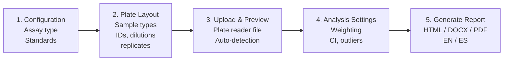
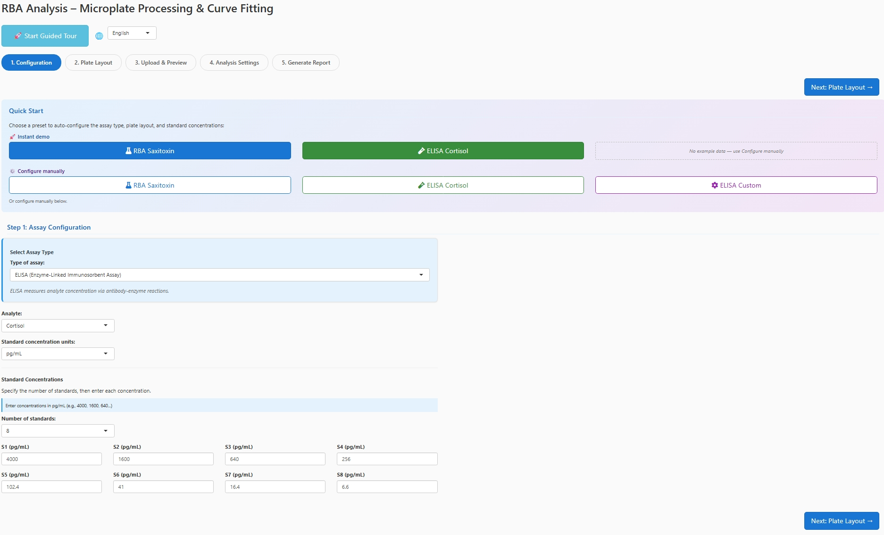
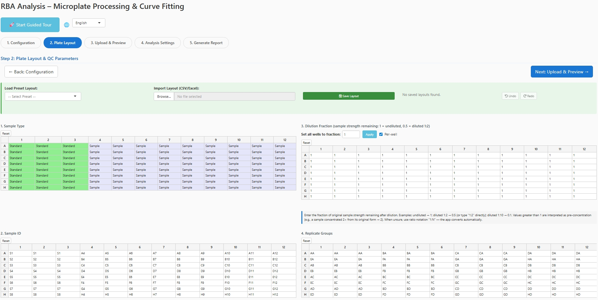
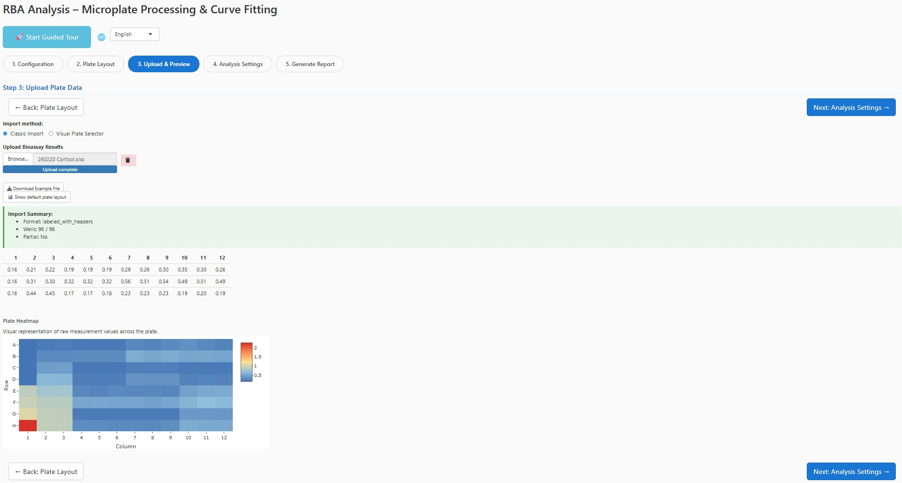
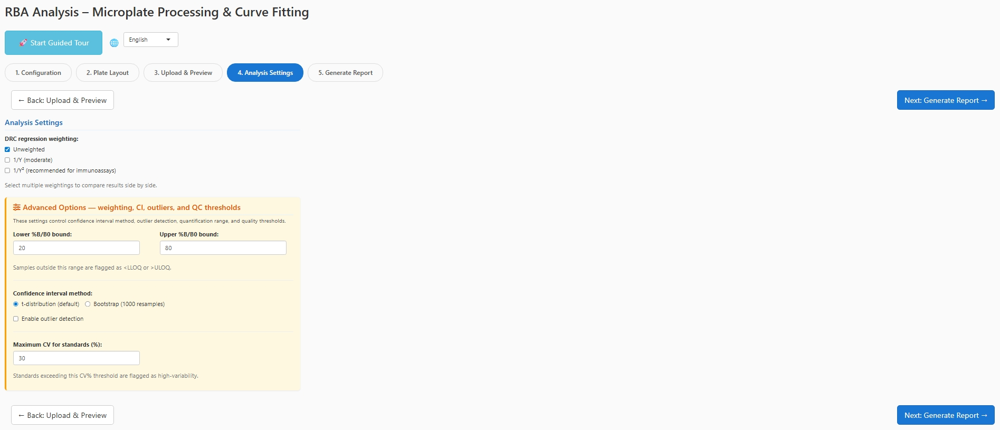
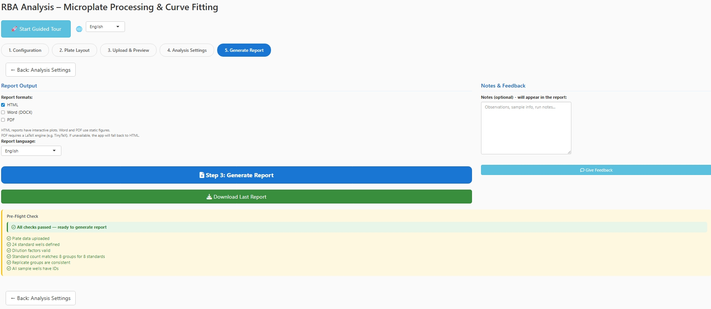
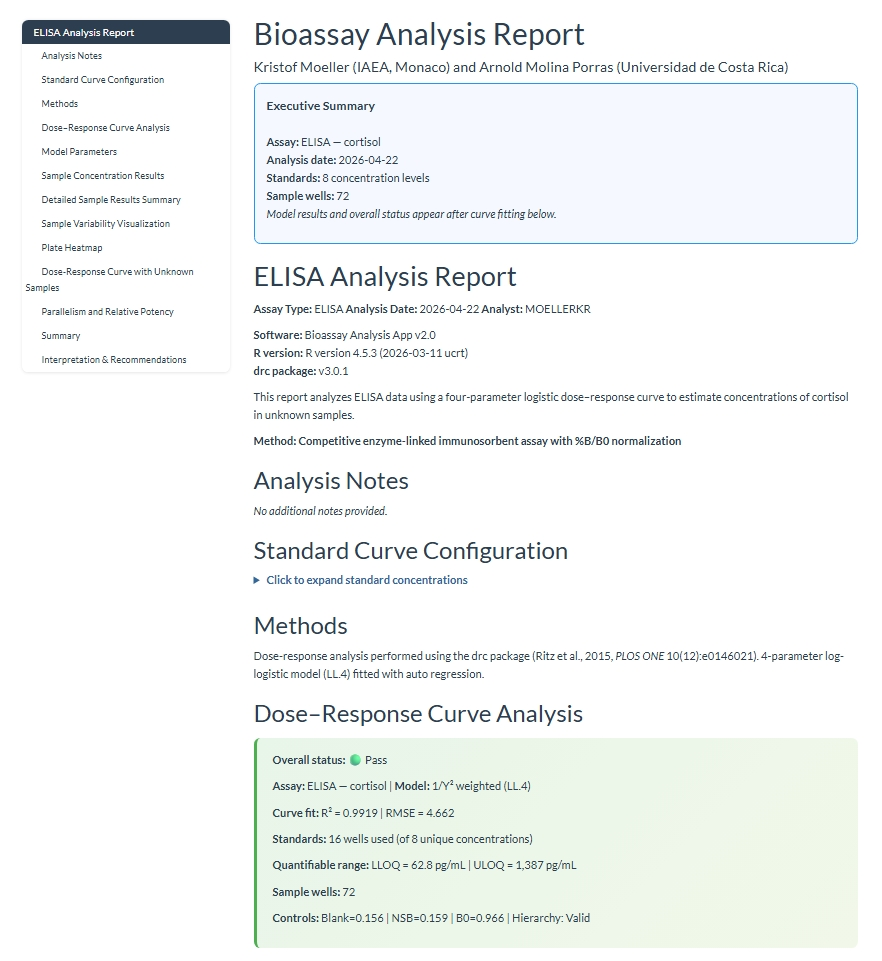
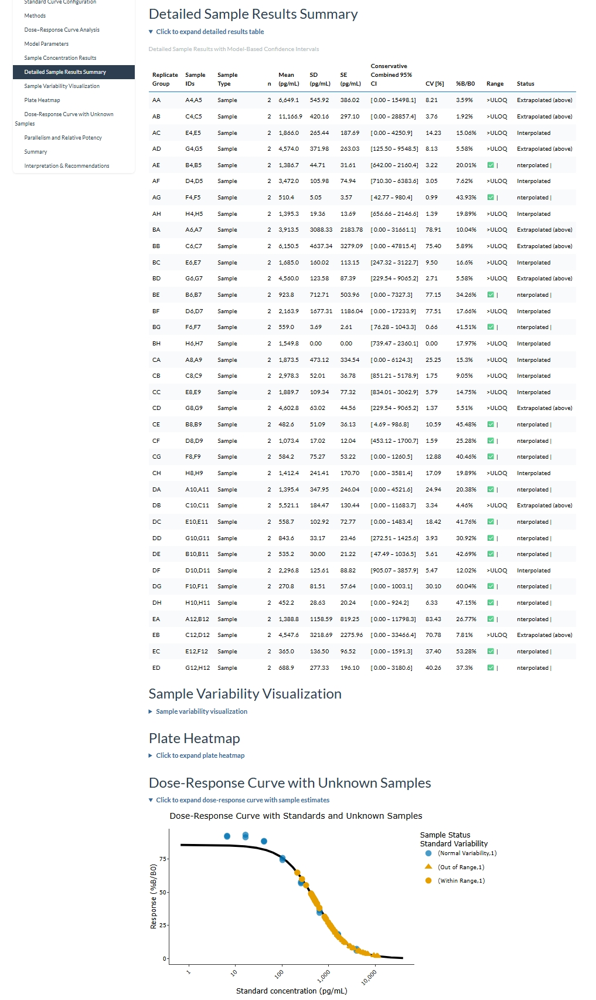

# Competitive Binding Assay Analysis Suite

[](https://opensource.org/licenses/MIT)
[](https://doi.org/10.5281/zenodo.19691224)

If you run receptor binding assays or ELISAs and want reproducible 4-parameter
logistic curve fitting, quantified samples with proper confidence intervals,
and a formatted HTML/Word/PDF report — this app does that in a guided 5-step
workflow. No R experience required beyond running one command. Works for
single or multi-wavelength plate readers.

Developed by **Arnold Molina Porras** (University of Costa Rica) and
**Kristof Moeller** (IAEA Marine Environment Laboratories, Monaco).

→ Jump to: [Statement of need](#statement-of-need) · [Quick Start](#quick-start) · [Example Data](#try-it-with-example-data) · [Features](#features) · [Troubleshooting](#troubleshooting) · [Citation](#how-to-cite)

## Statement of need

Quantifying samples from competitive binding assays (radioligand binding
assays, competitive ELISAs) requires fitting a four-parameter logistic
dose-response curve, validating it, and back-calculating unknowns with
defensible confidence intervals and quality control. The existing tooling
forces a trade-off. General curve-fitting packages such as R's `drc` (on
which this app builds) or web tools like ED50plus give a fit but leave plate
layout, control-hierarchy validation, %B/B0 normalization, LLOQ/ULOQ
determination, outlier handling, and reporting to the user. Proprietary
GUIs such as GraphPad Prism fit curves interactively but are closed-source,
licence-restricted, not assay-aware (no Blank/NSB/B0 logic, no plate
importer), and do not produce a reproducible, audit-ready report. Regulatory
dose-response platforms such as PROAST target toxicological benchmark-dose
modelling rather than competitive immuno/receptor assay quantification.

This application closes that gap with an end-to-end, assay-aware workflow:
guided 96-well plate-layout configuration, smart plate-reader file import
(single- and multi-wavelength), competitive-curve fitting with a
heteroscedasticity-driven weighting recommendation, formal QC profiling
(traffic-light pre-flight, CV thresholds, control-hierarchy checks,
LLOQ/ULOQ), and a one-click reproducible HTML/Word/PDF report with an
embedded metadata sidecar for replay. Every report can be regenerated from
its saved inputs via `scripts/replay_report.R`.

The target community is bench scientists in marine-biotoxin and
environmental-monitoring laboratories — for example IAEA Member State labs
and the University of Costa Rica setting this was developed for — who need
reproducible, defensible assay reports without writing R. The interface and
the generated report are bilingual (English / Spanish) to serve that user
base directly.

## The 5-step workflow



Each step is a tab in the app. Navigate forward and backward at any time;
progress is auto-saved every 60 seconds.

## Screenshots

### 1. Configuration — Quick Start and assay setup


Pick an assay type and load a preset, or configure manually. 
Quick Start presets auto-fill assay type, standard concentrations, 
and plate layout so you can go straight to uploading data.

### 2. Plate Layout — four synchronized matrices


Define sample type, sample ID, dilution fraction, and replicate 
groups in parallel. Presets, import from CSV/Excel, and 
undo/redo all supported.

### 3. Upload & Preview — auto-detected heatmap


The app auto-detects plate regions in `.xlsx`, `.csv`, and 
`.txt` files. The heatmap preview lets you confirm the correct 
region was detected before running the analysis.

### 4. Analysis Settings — statistical options


Choose regression weighting, confidence interval method, outlier 
detection strategy, and quantification range. The Advanced Options 
panel exposes CV thresholds and normality-test options for outlier 
detection.

### 5. Generate Report — formats, language, and pre-flight check


Select output formats (HTML, Word, PDF) and report language. 
The Pre-Flight Check panel confirms that plate data, standards, 
dilution factors, replicate groups, and sample IDs are all valid 
before generating.

### 6. Report — executive summary and dose-response curve


Every report opens with a colour-coded executive summary 
showing assay type, curve fit (R² and RMSE), quantifiable 
range (LLOQ/ULOQ), control hierarchy, and overall pass/fail status.

### 7. Report — quantified samples with confidence intervals


Per-replicate-group mean concentrations with 95% confidence 
intervals, CV, %B/B0, range flags, and interpolation status. 
The final dose-response plot overlays sample points on the 
fitted standard curve.

## Quick Start

Run directly from GitHub (requires R >= 4.2):

```r
shiny::runGitHub("Shiny-App-Competitive-Bioassays", "KristofM854")
```

Or clone and run locally:

```r
shiny::runApp("app.R")
```

## Try it with example data

Two example plate reader files are included in `examples/`:

- `rba_stx_example.csv` — RBA with saxitoxin standards in triplicate
- `elisa_cortisol_example.csv` — ELISA with cortisol standards and controls

To try the app without your own data:
1. Run `shiny::runGitHub(...)` as above
2. Click **RBA Saxitoxin** or **ELISA Cortisol** in the Quick Start panel
3. Upload the matching CSV from `examples/`
4. Click through to Step 5 and generate a report

See `examples/README.md` for details on each file.

## Features

### Workflow & usability
- Guided 5-step wizard with forward/backward navigation
- Undo/redo for plate layout edits (up to 20 states)
- Auto-save every 60 seconds with session restore on reload
- Preset layouts (RBA STX triplicate, ELISA Cortisol Cayman, ELISA custom blank)
- Quick-start buttons for one-click configuration
- Save / load / import plate layouts (CSV and Excel)
- Visual plate selector with per-well exclusion
- Pre-flight check panel with severity badges (red / amber / green)
- Bilingual interface (English / Spanish)

### Import
- Smart auto-detection of plate data in `.xlsx`, `.csv`, and `.txt`
- Multi-wavelength Excel file support with per-wavelength analysis
- Partial-plate handling (< 96 wells)
- Locale-aware decimal parsing (comma or period separators)
- Overflow marker handling (#SAT, OVER, ERR)

### Statistical analysis
- 4-parameter logistic (4PL) dose-response fitting via `drc` package
- Automatic fallback: LL.4 → LL.3; if both models fail the app stops with a
  clear error rather than silently interpolating
- Multiple regression weightings (unweighted, 1/Y, 1/Y²) compared side-by-side
- Formal heteroscedasticity diagnostic (Brown-Forsythe / variance-ratio)
- Model stability assessment (good / acceptable / unstable / failed)
- Layered uncertainty reporting (model delta-method vs replicate dispersion
  vs conservative combined interval)
- Optional parallelism / relative potency analysis for multi-curve data

### Quality control
- Configurable CV threshold for standards
- Assay-specific QC profiles (RBA vs ELISA thresholds)
- Outlier detection with Shapiro-Wilk pre-test:
  Dixon's Q (n=3-5), Grubbs (n≥6), MAD-based fallback for non-normal data
- Formal LLOQ/ULOQ determination via standard back-calculation accuracy
- Exclusion audit table documenting every excluded/flagged well

### ELISA-specific
- Cayman-protocol %B/B0 normalization with proper blank correction
- Tissue weight normalization with pg/g tissue calculation
- Per-replicate-group extraction volumes
- Full tissue-normalization traceability in the report

### Reporting
- HTML (interactive Plotly) / DOCX (static figures) / PDF output
- Graceful fallback from PDF to HTML if LaTeX is unavailable
- Bilingual reports (EN / ES) with 480+ translation keys
- Collapsible sections for navigation
- Multi-wavelength concordance analysis (Lin's CCC + Bland-Altman bias plots)
- Executive summary at the top, exclusion audit and interpretation at the bottom

## Project Structure

```
.
├── app.R                    # Entry point (UI + server assembly)
├── global.R                 # Packages, constants, theme, helpers
├── DESCRIPTION              # Package metadata and version
├── CITATION.cff             # Citation metadata
├── CODE_OF_CONDUCT.md
├── CONTRIBUTING.md
├── README.md
├── LICENSE
├── server/                  # Modular server logic
│   ├── i18n.R               # 480+ translation keys (EN/ES/FR/RU/ZH)
│   ├── layout_history.R     # Undo/redo for matrix edits
│   ├── report_pipeline.R    # Staged report-generation helpers
│   ├── server_analysis.R    # Tab 4 — weighting, CI, outlier settings
│   ├── server_common.R      # Auto-save, navigation, language switcher
│   ├── server_config.R      # Tab 1 — assay type, standards, QC inputs
│   ├── server_layout.R      # Tab 2 — plate matrix editors, presets
│   ├── server_report.R      # Tab 5 — pre-flight validation, report trigger
│   └── server_upload.R      # Tab 3 — file import, heatmap preview
├── utils/                   # Stateless helpers
│   ├── utils_import_v3.R               # Auto-detect plate region (xlsx/csv/txt)
│   ├── utils_import_multiwavelength.R  # Per-sheet multi-wavelength parsing
│   ├── utils_normalization.R           # ELISA %B/B0 blank correction
│   └── utils_plate.R                   # Matrix ↔ long-format conversion
├── reports/                 # Report templates and analysis pipeline
│   ├── analysis_pipeline.R                  # DRC fitting, LLOQ/ULOQ, quantification
│   ├── report_functions.R                   # Data loading, QC checks, heteroscedasticity
│   ├── report_sections.R                    # HTML section helpers
│   ├── plot_functions.R                     # render_table(), render_plot(), sections
│   ├── report_constants.R                   # Validation rules, output file names
│   ├── unified_analysis_template.Rmd        # Main single-wavelength report (~2100 lines)
│   ├── unified_analysis_template_compact.Rmd # Compact wrapper (params$compact = TRUE)
│   ├── multiwavelength_analysis_template.Rmd # Multi-wavelength wrapper
│   └── create_reference_doc.R               # DOCX reference document generator
├── presets/                 # Pre-built plate layouts
├── examples/                # Example datasets and regeneration scripts
├── scripts/                 # Standalone scripts (baseline capture, replay)
├── tests/testthat/          # Test suite
├── www/                     # Static web assets (CSS, JS)
├── docs/                    # Screenshots and supplementary docs
├── .github/workflows/       # CI configuration
└── audit/                   # JOSS audit deliverables
```

## Dependencies

### System dependencies

The application requires the following system-level tools in addition to the
R packages listed below.

- **pandoc** — required for rendering reports in any format. Bundled with
  RStudio; standalone install: `apt install pandoc` (Linux),
  `brew install pandoc` (macOS), or download from
  [pandoc.org](https://pandoc.org/installing.html) (Windows).
- **TinyTeX** — required only for PDF report output. Install from R:
  `tinytex::install_tinytex()`. HTML and DOCX outputs work without it.
- **Chrome or Chromium** — required only for running the `shinytest2` test
  suite during development. Not needed by end users.

### Required R Packages

| Category | Packages |
|----------|----------|
| **Shiny** | shiny, shinyjs, shinyFeedback, rintrojs, rhandsontable |
| **Data** | dplyr, tidyr, tibble, stringr, purrr, readr |
| **Plots** | ggplot2, ggrepel, ggthemes, ggtext, plotly, scales, patchwork |
| **Analysis** | drc, knitr, rmarkdown, kableExtra |
| **I/O** | readxl, jsonlite, digest |

### Known Issue: MASS::select Masking

The `drc` package loads `MASS`, which masks `dplyr::select()`. All `select()` calls in this codebase use the explicit `dplyr::select()` form. If you add new code, always use `dplyr::select()`.

## Workflow

1. **Configuration** — Select RBA or ELISA, choose the analyte, set the number of
   standards, and enter standard concentrations. For RBA, also set expected
   Hill slope and QC concentration.

2. **Plate Layout** — Define the 96-well layout using four matrices:
   Sample Type, Sample ID, Dilution Fraction, and Replicate Groups.
   For ELISA, also enter tissue weights per replicate group if tissue
   normalization is desired. Presets are available for common layouts.

3. **Upload & Preview** — Upload the plate reader file (.xlsx / .csv / .txt).
   The app auto-detects the plate region and displays a heatmap preview.
   Switch to the Visual Plate Selector for manual region selection.

4. **Analysis Settings** — Choose DRC regression weighting(s), quantification
   range bounds, confidence interval method (t-distribution or bootstrap),
   outlier detection options, and CV threshold for standards.

5. **Generate Report** — Select output format(s) (HTML, DOCX, PDF) and language
   (EN, ES). Add optional notes. Click Generate Report.

## Output

Reports and data files are saved to a date-stamped folder (e.g., `2026-02-22/`). If the folder already exists, a suffix is appended (`_01`, `_02`, etc.).

Output files include:
- `long_data_output.csv` -- Plate data in long format
- `unknown_results.csv` -- Individual sample predictions
- `unknown_results_summary.csv` -- Replicate-level summary statistics
- `model_stats.json` -- DRC model parameters and QC metrics
- `analysis_report.html` / `.docx` / `.pdf` -- Final report

## Troubleshooting

### "Could not detect plate data in file"
The app looks for an 8×12 (or 8×N for partial plates) block of numeric data
with row labels A–H. If your plate reader exports with a long metadata
header or an unusual layout, switch to the Visual Plate Selector in Step 3
and manually select the plate region.

### DRC fitting fails
The app automatically falls back from LL.4 (4-parameter logistic) to LL.3
(3-parameter, fixed bottom). If both models fail, the app stops with a clear
error rather than silently interpolating. Check:
- At least 4 unique standard concentrations have valid numeric responses
- Standards aren't all flagged as high-variability (CV > threshold); lower
  the CV threshold in Analysis Settings if needed
- Response values aren't all identical (zero variance)

### PDF report didn't generate
PDF output requires a LaTeX engine. The app auto-detects TinyTeX, pdflatex,
xelatex, or lualatex. If none is found, it falls back to HTML with a
notification. To enable PDF output:

```r
install.packages("tinytex")
tinytex::install_tinytex()
```

### ELISA report crashed on "missing control wells"
ELISA analysis requires Blank, NSB, and B0 wells. Go back to Step 2
(Plate Layout) and assign these in the Type matrix (typically in column 1).

### My dilution factors look wrong in the output
The DilutionFactor field expects *fraction of original strength remaining*:
undiluted = 1, diluted 1:2 = 0.5, diluted 1:10 = 0.1. The ratio parser
accepts `1:2` notation directly and is the recommended input form. Values
greater than 1 are interpreted as pre-concentration and will *reduce* the
reported concentration.

### Tissue-normalized concentrations seem off by a factor of 10 or 100
Check that extraction volume is entered in µL and tissue weight in mg.
The app converts to mL and g internally before computing pg/g tissue.

### Report shows "Interpolated" but also ">ULOQ" — which is it?
Both. "Interpolated" means the estimate is within the range of the fitted
standards (curve coverage). ">ULOQ" means it's outside the validated
quantifiable range (EC20/EC80 for RBA, %B/B0 bounds for ELISA). A sample can
be interpolated but above ULOQ if the response sits on the flat portion of
the curve near the top asymptote.

## How to cite

If you use this software in published work, please cite:

> Moeller, K. & Molina Porras, A. (2026). *Competitive Binding Assay Analysis Suite* (v1.0.0) [Computer software]. Zenodo. https://doi.org/10.5281/zenodo.19691224

## Contact

For questions or bug reports: kr.moeller@iaea.org

[Give Feedback](https://forms.office.com/e/q8eqJfp4QM)

## License

This project is licensed under the MIT License — see the [LICENSE](LICENSE) file for details.

Copyright (c) 2026 Kristof Moeller and Arnold Molina Porras.
