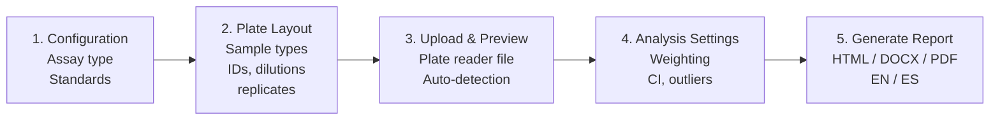

# Competitive Binding Assay Analysis Suite

If you run receptor binding assays or ELISAs and want reproducible 4-parameter
logistic curve fitting, quantified samples with proper confidence intervals,
and a formatted HTML/Word/PDF report — this app does that in a guided 5-step
workflow. No R experience required beyond running one command. Works for
single or multi-wavelength plate readers.

Developed by **Arnold Molina Porras** (University of Costa Rica) and
**Kristof Moeller** (IAEA Marine Environment Laboratories, Monaco).

→ Jump to: [Quick Start](#quick-start) · [Example Data](#try-it-with-example-data) · [Features](#features) · [Troubleshooting](#troubleshooting) · [Citation](#how-to-cite)

## The 5-step workflow



Each step is a tab in the app. Navigate forward and backward at any time;
progress is auto-saved every 60 seconds.

*(Screenshots for each step will be added in a future release.)*

## Quick Start

Run directly from GitHub (requires R >= 4.2):

```r
shiny::runGitHub("Shiny-App-Competitive-Bioassays", "KristofM854")
```

Or clone and run locally:

```r
source("run_analysis_modular.R")
```

## Try it with example data

Two example plate reader files are included in `examples/`:

- `rba_stx_example.csv` — RBA with saxitoxin standards in triplicate
- `elisa_cortisol_example.csv` — ELISA with cortisol standards and controls

To try the app without your own data:
1. Run `shiny::runGitHub(...)` as above
2. Click **RBA Saxitoxin** or **ELISA Cortisol** in the Quick Start panel
3. Upload the matching CSV from `examples/`
4. Click through to Step 5 and generate a report

See `examples/README.md` for details on each file.

## Features

### Workflow & usability
- Guided 5-step wizard with forward/backward navigation
- Undo/redo for plate layout edits (up to 20 states)
- Auto-save every 60 seconds with session restore on reload
- Preset layouts (RBA STX triplicate, ELISA Cortisol Cayman, ELISA custom blank)
- Quick-start buttons for one-click configuration
- Save / load / import plate layouts (CSV and Excel)
- Visual plate selector with per-well exclusion
- Pre-flight check panel with severity badges (red / amber / green)
- Bilingual interface (English / Spanish)

### Import
- Smart auto-detection of plate data in `.xlsx`, `.csv`, and `.txt`
- Multi-wavelength Excel file support with per-wavelength analysis
- Partial-plate handling (< 96 wells)
- Locale-aware decimal parsing (comma or period separators)
- Overflow marker handling (#SAT, OVER, ERR)

### Statistical analysis
- 4-parameter logistic (4PL) dose-response fitting via `drc` package
- Automatic fallback: LL.4 → LL.3 → log-linear interpolation
- Multiple regression weightings (unweighted, 1/Y, 1/Y²) compared side-by-side
- Formal heteroscedasticity diagnostic (Brown-Forsythe / variance-ratio)
- Model stability assessment (good / acceptable / unstable / failed)
- Layered uncertainty reporting (model delta-method vs replicate dispersion
  vs conservative combined interval)
- Optional parallelism / relative potency analysis for multi-curve data

### Quality control
- Configurable CV threshold for standards
- Assay-specific QC profiles (RBA vs ELISA thresholds)
- Outlier detection with Shapiro-Wilk pre-test:
  Dixon's Q (n=3-5), Grubbs (n≥6), MAD-based fallback for non-normal data
- Formal LLOQ/ULOQ determination via standard back-calculation accuracy
- Exclusion audit table documenting every excluded/flagged well

### ELISA-specific
- Cayman-protocol %B/B0 normalization with proper blank correction
- Tissue weight normalization with pg/g tissue calculation
- Per-replicate-group extraction volumes
- Full tissue-normalization traceability in the report

### Reporting
- HTML (interactive Plotly) / DOCX (static figures) / PDF output
- Graceful fallback from PDF to HTML if LaTeX is unavailable
- Bilingual reports (EN / ES) with 480+ translation keys
- Collapsible sections for navigation
- Multi-wavelength concordance analysis (Lin's CCC + Bland-Altman bias plots)
- Executive summary at the top, exclusion audit and interpretation at the bottom

## Project Structure

```
.
├── app.R                          # Main Shiny app (UI + server)
├── global.R                       # Packages, constants, theme, helpers
├── i18n.R                         # Bilingual translations (EN/ES)
├── run_analysis_modular.R         # Local entry point (env setup + report render)
├── utils_plate.R                  # Plate matrix creation and conversion
├── utils_import_v3.R              # Smart plate reader file import
├── utils_import_multiwavelength.R # Multi-wavelength Excel parsing
├── utils_normalization.R          # ELISA %B/B0 normalization
└── reports/
    ├── unified_analysis_template.Rmd         # Single-wavelength report
    ├── multiwavelength_analysis_template.Rmd # Multi-wavelength wrapper
    ├── report_functions.R                    # Analysis functions (DRC, QC)
    ├── report_constants.R                    # Report-specific constants
    └── plot_functions.R                      # Standardized plot/table rendering
```

## Dependencies

### Required R Packages

| Category | Packages |
|----------|----------|
| **Shiny** | shiny, shinyjs, shinyFeedback, rintrojs, rhandsontable |
| **Data** | dplyr, tidyr, tibble, stringr, purrr, readr |
| **Plots** | ggplot2, ggrepel, ggthemes, ggtext, plotly, scales, patchwork |
| **Analysis** | drc, knitr, rmarkdown, kableExtra |
| **I/O** | readxl, jsonlite, digest |

### Known Issue: MASS::select Masking

The `drc` package loads `MASS`, which masks `dplyr::select()`. All `select()` calls in this codebase use the explicit `dplyr::select()` form. If you add new code, always use `dplyr::select()`.

## Workflow

1. **Configuration** — Select RBA or ELISA, choose the analyte, set the number of
   standards, and enter standard concentrations. For RBA, also set expected
   Hill slope and QC concentration.

2. **Plate Layout** — Define the 96-well layout using four matrices:
   Sample Type, Sample ID, Dilution Fraction, and Replicate Groups.
   For ELISA, also enter tissue weights per replicate group if tissue
   normalization is desired. Presets are available for common layouts.

3. **Upload & Preview** — Upload the plate reader file (.xlsx / .csv / .txt).
   The app auto-detects the plate region and displays a heatmap preview.
   Switch to the Visual Plate Selector for manual region selection.

4. **Analysis Settings** — Choose DRC regression weighting(s), quantification
   range bounds, confidence interval method (t-distribution or bootstrap),
   outlier detection options, and CV threshold for standards.

5. **Generate Report** — Select output format(s) (HTML, DOCX, PDF) and language
   (EN, ES). Add optional notes. Click Generate Report.

## Output

Reports and data files are saved to a date-stamped folder (e.g., `2026-02-22/`). If the folder already exists, a suffix is appended (`_01`, `_02`, etc.).

Output files include:
- `long_data_output.csv` -- Plate data in long format
- `unknown_results.csv` -- Individual sample predictions
- `unknown_results_summary.csv` -- Replicate-level summary statistics
- `model_stats.json` -- DRC model parameters and QC metrics
- `analysis_report.html` / `.docx` / `.pdf` -- Final report

## Troubleshooting

### "Could not detect plate data in file"
The app looks for an 8×12 (or 8×N for partial plates) block of numeric data
with row labels A–H. If your plate reader exports with a long metadata
header or an unusual layout, switch to the Visual Plate Selector in Step 3
and manually select the plate region.

### DRC fitting fails
The app automatically falls back from LL.4 (4-parameter logistic) to LL.3
(3-parameter, fixed bottom) to log-linear interpolation. If all three fail,
check:
- At least 4 unique standard concentrations have valid numeric responses
- Standards aren't all flagged as high-variability (CV > threshold); lower
  the CV threshold in Analysis Settings if needed
- Response values aren't all identical (zero variance)

### PDF report didn't generate
PDF output requires a LaTeX engine. The app auto-detects TinyTeX, pdflatex,
xelatex, or lualatex. If none is found, it falls back to HTML with a
notification. To enable PDF output:

```r
install.packages("tinytex")
tinytex::install_tinytex()
```

### ELISA report crashed on "missing control wells"
ELISA analysis requires Blank, NSB, and B0 wells. Go back to Step 2
(Plate Layout) and assign these in the Type matrix (typically in column 1).

### My dilution factors look wrong in the output
The DilutionFactor field expects *fraction of original strength remaining*:
undiluted = 1, diluted 1:2 = 0.5, diluted 1:10 = 0.1. The ratio parser
accepts `1:2` notation directly and is the recommended input form. Values
greater than 1 are interpreted as pre-concentration and will *reduce* the
reported concentration.

### Tissue-normalized concentrations seem off by a factor of 10 or 100
Check that extraction volume is entered in µL and tissue weight in mg.
The app converts to mL and g internally before computing pg/g tissue.

### Report shows "Interpolated" but also ">ULOQ" — which is it?
Both. "Interpolated" means the estimate is within the range of the fitted
standards (curve coverage). ">ULOQ" means it's outside the validated
quantifiable range (EC20/EC80 for RBA, %B/B0 bounds for ELISA). A sample can
be interpolated but above ULOQ if the response sits on the flat portion of
the curve near the top asymptote.

## How to cite

If you use this software in published work, please cite:

> Moeller, K. & Molina Porras, A. (2026). *Competitive Binding Assay Analysis
> Suite* (v2.0.0) [Computer software].
> https://github.com/KristofM854/Shiny-App-Competitive-Bioassays

A persistent DOI via Zenodo is planned for the next tagged release; update
this citation once the DOI is available.

## Contact

For questions or bug reports: kr.moeller@iaea.org

[Give Feedback](https://forms.office.com/e/q8eqJfp4QM)
