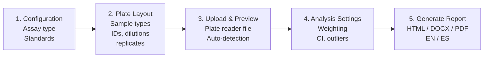

# Implementation Plan: Scientific Clarity, Documentation, and README Overhaul

**Repo:** `KristofM854/Shiny-App-Competitive-Bioassays`
**Scope:** Targeted improvements to analytical-pipeline clarity, inline code documentation, and user-facing README.
**Ground rule:** No changes to the analytical math. All fixes are either documentation, UI labeling, or pure-refactor moves of constants.

---

## Phase 1 — Scientific correctness and clarity (UI + report only)

### 1.1 Dilution factor semantics — UI relabeling (keep existing math)

**Problem:** Users typing `2` into the dilution matrix may mean "2-fold dilution" (sample strength halved), but the current math `estimated_concentration = estimate_diluted / dilution` treats the entered value as *fraction of original strength remaining*. A user entering `2` gets their result halved instead of doubled. The ratio form (`1:2` → 0.5) already works correctly.

**Decision:** Keep the math. Relabel the UI and add guardrails so the stored value is always "fraction remaining" and users are nudged to enter ratio form or values ≤ 1.

**Files to change:**
- `app.R` — plate layout section label and help text
- `i18n.R` — new keys for label and help text (EN + ES)

**Changes:**

1. In `app.R`, rename the dilution matrix section heading from:
   ```
   4. Dilution Factors (numeric or ratio like 1:2)
   ```
   to:
   ```
   3. Dilution Fraction (sample strength remaining: 1 = undiluted, 0.5 = diluted 1:2)
   ```

2. Rename the "Set all to:" label in the uniform dilution controls from `"Set all to:"` to `"Set all wells to fraction:"`.

3. Add a help text block below the dilution matrix:
   > "Enter the fraction of original sample strength remaining after dilution. Examples: undiluted → 1; diluted 1:2 → 0.5 (or type `1:2` directly); diluted 1:10 → 0.1. Values greater than 1 are interpreted as pre-concentration (e.g., a sample concentrated 2× from its original form → 2). When unsure, use ratio notation `1:N` — the app converts automatically."

4. Add a non-blocking validation warning: if any cell in the raw dilution matrix parses to a numeric value > 1 AND was not entered in ratio form (i.e., contains no colon), show an amber banner below the matrix:
   > "⚠️ One or more wells have dilution fraction > 1. This indicates pre-concentration and will reduce reported concentrations. If you meant a 2-fold dilution, enter `1:2` instead of `2`."

   Implementation hint: add a new reactive `dilution_gt1_warning` that watches `shared$raw_matrix_dilution()` and emits the UI block. Do not block the Convert button — this is only a nudge.

5. Add i18n keys to both EN and ES blocks in `i18n.R`:
   - `dilution_matrix_label`
   - `dilution_matrix_help`
   - `dilution_set_all_label`
   - `dilution_gt1_warning`

**Acceptance criteria:**
- The field label in the app clearly states that values represent fraction remaining, not fold dilution.
- A user entering `2` gets a visible warning but is not blocked.
- Ratio notation `1:N` continues to work exactly as before.
- No change to the math in `sample-analysis` or any other chunk.

---

### 1.2 Tissue normalization formula display

**File:** `reports/unified_analysis_template.Rmd`, chunk `tissue-normalization-traceability`

Replace the abstract formula currently shown:
```
C_tissue = (C_extract × V_extraction) / m_tissue
```

with an explicit unit-aware version:
```
C_tissue (pg/g) = C_extract (pg/mL) × [V_extraction (µL) / 1000]
                  ─────────────────────────────────────────────────
                                  m_tissue (mg) / 1000

Where:
  • C_extract   = concentration in the original (undiluted) extract, from the curve
  • V_extraction = total volume the tissue was extracted into
  • m_tissue    = mass of tissue extracted
```

Immediately after the formula, add a **worked example** using the first sample in the current report. Read the actual values from `replicate_stats` (first row with tissue weight) and show the arithmetic step by step so a reviewer can reproduce the number by hand.

**Acceptance criteria:**
- The displayed formula shows unit conversions explicitly.
- A worked example with real numbers from the current report appears immediately below.

---

### 1.3 Extraction volume guidance (tooltip + report note)

**Files:**
- `app.R` — tissue weight section
- `reports/unified_analysis_template.Rmd` — tissue-normalization-traceability chunk
- `i18n.R` — new keys

**Changes:**

1. Add a help text block below the tissue weight table in `app.R`:
   > "Extraction volume = total volume the tissue was extracted into, before any plate-loading dilutions. Example: 50 mg tissue homogenized in 500 µL buffer, then diluted 1:10 before plate loading → enter `500` here, and record the `1:10` in the DilutionFactor matrix."

2. Add the same note to the tissue traceability section of the report, immediately below the formula.

3. Add i18n keys: `extraction_volume_help`, `extraction_volume_report_note` (EN + ES).

**Acceptance criteria:**
- Users see the guidance both during data entry and in the final report.
- The distinction between extraction volume and per-well dilution is unambiguous.

---

### 1.4 Interpolated/Extrapolated vs LLOQ/ULOQ clarification

**File:** `reports/unified_analysis_template.Rmd`, report-interpretation chunk (near the quantification status breakdown)

Keep both indicators — they answer different questions. Add this explicit note immediately before the quantification-status breakdown:

> "**Two independent range indicators appear in this report:**
>
> - **Interpolated / Extrapolated** refers to whether the estimated concentration falls within the range of fitted standard concentrations on this plate. This is a statement about curve coverage.
> - **Within range / <LLOQ / >ULOQ** refers to whether the estimate falls within the validated linear (quantifiable) range of the dose-response curve, defined by EC20/EC80 for RBA or %B/B0 bounds (default 20–80%) for ELISA. This is a statement about reporting quality.
>
> A sample can be interpolated but outside the quantifiable range (e.g., the response falls on the flat portion of the curve near the top or bottom asymptote), or within the quantifiable range but technically extrapolated (if the user provided few standards). Both flags should be considered when interpreting results."

Add i18n keys: `range_indicators_explanation` (EN + ES).

**Acceptance criteria:**
- The note appears in both EN and ES reports.
- Readers understand why two apparently overlapping flags exist.

---

### 1.5 Outlier handling documentation

**File:** `reports/unified_analysis_template.Rmd`, outlier-results chunk

Add a clarifying paragraph at the top of the outlier detection section:

> "Flagged outliers remain visible in the per-well detailed results table and in CSV exports, but are excluded from the calculation of replicate-group mean, SD, CV, and confidence intervals. This preserves full raw-data visibility while preventing outlier contamination of summary statistics."

Add i18n key: `outlier_flagged_not_removed_note` (EN + ES).

**Acceptance criteria:**
- The distinction between "flagged" and "removed from stats" is explicit in the report.

---

## Phase 2 — Code documentation and maintainability

### 2.1 Chunk-sequence roadmap in the unified template

**File:** `reports/unified_analysis_template.Rmd`

Add this annotated block immediately after the YAML front matter, before the `setup` chunk:

```r
# ==============================================================================
# Chunk pipeline (in execution order):
#
#   setup                           — libraries, output_dir, i18n, source helpers
#   load-data                       — read CSV, validate, compute %B/B0 for ELISA
#   executive-summary               — top-of-report status box
#   standards-table                 — display standard concentrations
#   methods-section                 — methods paragraph with citations
#   model-fitting                   — fit all selected weightings (LL.4 → LL.3 →
#                                     interpolation fallback); defines:
#                                     all_models, model_fit, R2, RMSE,
#                                     conc_range, model_fits, ec20, ec80,
#                                     classify_range(), flag_range()
#   exec-summary-box                — rendered exec summary (needs model_fit)
#   weight-comparison               — overlay plot of weightings (HTML)
#   weighting-suitability           — Brown-Forsythe / variance ratio
#   model-stability-assessment      — convergence / boundary diagnostics
#   lloq-uloq                       — back-calculation accuracy → formal LLOQ/ULOQ
#   dose-response-plots             — main DRC plot
#   model-stats                     — 4PL coefficient table
#   save-model-stats                — write model_stats.json (partial)
#   standard-backcalculation        — per-standard recovery table
#   data-quality-overview           — quick data quality panel
#   sample-analysis                 — MAIN SAMPLE QUANTIFICATION (defines:
#                                     sample_results, replicate_stats,
#                                     outlier_flags, replicate_summary,
#                                     tissue-normalized columns if ELISA)
#   sample-results-table            — rendered sample table + CSV writes
#   outlier-results                 — outlier detection report block
#   ci-method-note                  — CI method footnote
#   save-sample-stats               — updates model_stats.json with mean_sample_cv
#   summary-results-table           — detailed replicate summary
#   sample-boxplot                  — variability visualization
#   plate-heatmap                   — plate heatmap
#   plate-positional-qc             — row/column bias check
#   drc-with-samples                — DRC plot with sample points overlaid
#   parallelism-assessment          — optional multi-curve comparison
#   report-summary                  — high-level summary bullets
#   report-interpretation           — QC-profile-based interpretation
#   tissue-normalization-traceability — ELISA + tissue only
#   exclusion-audit                 — formal exclusion audit table
#
# Key cross-chunk dependencies:
#   - model-fitting defines variables used by almost all later chunks
#   - sample-analysis must run before sample-results-table, outlier-results,
#     save-sample-stats, summary-results-table, sample-boxplot
#   - tissue_weights (ELISA) is loaded inside sample-analysis
# ==============================================================================
```

**Acceptance criteria:**
- The file is navigable for a new reader in under 5 minutes.

---

### 2.2 Explain `classify_range()` choice of reference axis

**File:** `reports/unified_analysis_template.Rmd`, near the `classify_range()` helper definition inside the `model-fitting` chunk

Add this comment block immediately above the function:

```r
# classify_range(): uses different reference axes depending on assay type.
#
# ELISA: classifies by %B/B0 response value. The kit manufacturer
#   (e.g., Cayman) defines the reliable quantification range in terms of
#   %B/B0 bounds (default 20–80%). The response axis is bounded [0, 100],
#   so %B/B0 is the natural reference.
#
# RBA: classifies by estimated concentration vs EC20/EC80 concentrations,
#   following the AOAC SMPR recommendation for radioligand binding assays.
#   The response axis (CPM) is unbounded, so concentration is the natural
#   reference.
#
# Both approaches identify samples falling outside the linear portion of the
# dose-response curve; they just use different axes to do so.
```

---

### 2.3 Expand `matrix_to_long()` column-major comment

**File:** `utils_plate.R`, in `matrix_to_long()`

Replace the brief comment with a worked example:

```r
# Column-major unrolling of the plate matrix. R's as.matrix() flattens
# columns first, so the vector order is:
#
#   Well A1 = row 1, col 1  → vector index 1
#   Well B1 = row 2, col 1  → vector index 2
#   ...
#   Well H1 = row 8, col 1  → vector index 8
#   Well A2 = row 1, col 2  → vector index 9
#   ...
#
# This matches rep(ROW_NAMES, times=PLATE_NCOL) for rows and
# rep(COL_NAMES, each=PLATE_NROW) for columns, so the Row/Column/Well
# vectors align element-for-element with the flattened matrix data.
```

---

### 2.4 Cross-reference comments between server files

**File:** `server_report.R` — add at the top:
```r
# Pipeline stage helpers (flush_latest_layout_state, build_long_data,
# normalize_assay_data, save_analysis_artifacts, render_reports) are
# defined in report_pipeline.R.
```

**File:** `report_pipeline.R` — add at the top:
```r
# Called from server_report.R via observeEvent(input$convert). Each stage
# is a pure function that can be tested in isolation.
```

---

### 2.5 Add closure usage example to `matrix_to_long_with_cached_layout()`

**File:** `utils_plate.R`

Extend the existing roxygen block:
```r
#' @examples
#' # Build the converter once using shared layout matrices
#' converter <- matrix_to_long_with_cached_layout(
#'   type_mat, id_mat, dil_mat, rep_mat, std_conc
#' )
#'
#' # Convert each wavelength's plate individually
#' df_450 <- converter(plate_at_450nm)
#' df_630 <- converter(plate_at_630nm)
```

---

### 2.6 Move magic numbers to a single constants block

**File:** `reports/report_constants.R`

Add a new `STATS_CONFIG` list near the top, after `QC_THRESHOLDS`:

```r
# Statistical thresholds used across the report template.
# Values chosen based on common immunoassay-analysis conventions; change
# in one place to propagate everywhere.
STATS_CONFIG <- list(
  # Bootstrap resampling
  bootstrap_iterations = 1000,     # per-replicate-group percentile bootstrap

  # Outlier detection
  mad_outlier_threshold = 3,       # MAD z-score cutoff for non-normal data
                                   # (Leys et al. 2013, "very conservative" = 3)
  dixon_alpha = 0.05,              # Dixon's Q-test significance level
  shapiro_alpha = 0.05,            # Shapiro-Wilk normality pre-test level

  # ED() calls: drc::ED measures response *reduction* from the top asymptote,
  # so respLev = 80 returns the concentration where response has dropped to
  # 20% (EC20), and respLev = 20 returns EC80.
  ec20_resp_level = 80,
  ec80_resp_level = 20,

  # Heteroscedasticity variance-ratio heuristic (fallback when formal
  # Brown-Forsythe is not feasible)
  heteroscedasticity_variance_ratio_strong = 10,
  heteroscedasticity_variance_ratio_moderate = 3,

  # Display conventions
  ci_truncation_floor = 0          # negative lower bounds displayed as 0
)
```

Then replace the magic numbers in `unified_analysis_template.Rmd` and `reports/report_functions.R` with references to `STATS_CONFIG$<key>`. Do not change the numeric values — only the references.

**Files to grep and update:**
- `unified_analysis_template.Rmd`: search for `1000` (bootstrap), `respLev = 80`, `respLev = 20`, `pmax(ci_lower, 0)`
- `report_functions.R`: search for `mad_scores > 3`, `variance_ratio > 10`, `variance_ratio > 3`, bootstrap counts

**Acceptance criteria:**
- A single grep for each threshold value in the report template returns no matches outside `STATS_CONFIG`.

---

## Phase 3 — README overhaul

**File:** `README.md` — full rewrite using the structure below.

### 3.1 New opening summary (replaces current top section)

```markdown
# Competitive Binding Assay Analysis Suite

If you run receptor binding assays or ELISAs and want reproducible 4-parameter
logistic curve fitting, quantified samples with proper confidence intervals,
and a formatted HTML/Word/PDF report — this app does that in a guided 5-step
workflow. No R experience required beyond running one command. Works for
single or multi-wavelength plate readers.

Developed by **Arnold Molina Porras** (University of Costa Rica) and
**Kristof Moeller** (IAEA Marine Environment Laboratories, Monaco).

→ Jump to: [Quick Start](#quick-start) · [Example Data](#try-it-with-example-data) · [Features](#features) · [Troubleshooting](#troubleshooting) · [Citation](#how-to-cite)
```

### 3.2 Wizard flowchart (Mermaid, GitHub-native)

Immediately after the opening summary:

````markdown
## The 5-step workflow



Each step is a tab in the app. Navigate forward and backward at any time;
progress is auto-saved every 60 seconds.

*(Screenshots for each step will be added in a future release.)*
````

### 3.3 Quick Start (keep existing, unchanged)

### 3.4 Try it with example data (new section, after Quick Start)

```markdown
## Try it with example data

Two example plate reader files are included in `examples/`:

- `rba_stx_example.csv` — RBA with saxitoxin standards in triplicate
- `elisa_cortisol_example.csv` — ELISA with cortisol standards and controls

To try the app without your own data:
1. Run `shiny::runGitHub(...)` as above
2. Click **RBA Saxitoxin** or **ELISA Cortisol** in the Quick Start panel
3. Upload the matching CSV from `examples/`
4. Click through to Step 5 and generate a report

See `examples/README.md` for details on each file.
```

### 3.5 Expanded Features section (replaces current Features)

```markdown
## Features

### Workflow & usability
- Guided 5-step wizard with forward/backward navigation
- Undo/redo for plate layout edits (up to 20 states)
- Auto-save every 60 seconds with session restore on reload
- Preset layouts (RBA STX triplicate, ELISA Cortisol Cayman, ELISA custom blank)
- Quick-start buttons for one-click configuration
- Save / load / import plate layouts (CSV and Excel)
- Visual plate selector with per-well exclusion
- Pre-flight check panel with severity badges (red / amber / green)
- Bilingual interface (English / Spanish)

### Import
- Smart auto-detection of plate data in `.xlsx`, `.csv`, and `.txt`
- Multi-wavelength Excel file support with per-wavelength analysis
- Partial-plate handling (< 96 wells)
- Locale-aware decimal parsing (comma or period separators)
- Overflow marker handling (#SAT, OVER, ERR)

### Statistical analysis
- 4-parameter logistic (4PL) dose-response fitting via `drc` package
- Automatic fallback: LL.4 → LL.3 → log-linear interpolation
- Multiple regression weightings (unweighted, 1/Y, 1/Y²) compared side-by-side
- Formal heteroscedasticity diagnostic (Brown-Forsythe / variance-ratio)
- Model stability assessment (good / acceptable / unstable / failed)
- Layered uncertainty reporting (model delta-method vs replicate dispersion
  vs conservative combined interval)
- Optional parallelism / relative potency analysis for multi-curve data

### Quality control
- Configurable CV threshold for standards
- Assay-specific QC profiles (RBA vs ELISA thresholds)
- Outlier detection with Shapiro-Wilk pre-test:
  Dixon's Q (n=3-5), Grubbs (n≥6), MAD-based fallback for non-normal data
- Formal LLOQ/ULOQ determination via standard back-calculation accuracy
- Exclusion audit table documenting every excluded/flagged well

### ELISA-specific
- Cayman-protocol %B/B0 normalization with proper blank correction
- Tissue weight normalization with pg/g tissue calculation
- Per-replicate-group extraction volumes
- Full tissue-normalization traceability in the report

### Reporting
- HTML (interactive Plotly) / DOCX (static figures) / PDF output
- Graceful fallback from PDF to HTML if LaTeX is unavailable
- Bilingual reports (EN / ES) with 480+ translation keys
- Collapsible sections for navigation
- Multi-wavelength concordance analysis (Lin's CCC + Bland-Altman bias plots)
- Executive summary at the top, exclusion audit and interpretation at the bottom
```

### 3.6 Renumbered Workflow section (1–5 matching wizard tabs exactly)

Replace the existing Workflow section with:

```markdown
## Workflow

1. **Configuration** — Select RBA or ELISA, choose the analyte, set the number of
   standards, and enter standard concentrations. For RBA, also set expected
   Hill slope and QC concentration.

2. **Plate Layout** — Define the 96-well layout using four matrices:
   Sample Type, Sample ID, Dilution Fraction, and Replicate Groups.
   For ELISA, also enter tissue weights per replicate group if tissue
   normalization is desired. Presets are available for common layouts.

3. **Upload & Preview** — Upload the plate reader file (.xlsx / .csv / .txt).
   The app auto-detects the plate region and displays a heatmap preview.
   Switch to the Visual Plate Selector for manual region selection.

4. **Analysis Settings** — Choose DRC regression weighting(s), quantification
   range bounds, confidence interval method (t-distribution or bootstrap),
   outlier detection options, and CV threshold for standards.

5. **Generate Report** — Select output format(s) (HTML, DOCX, PDF) and language
   (EN, ES). Add optional notes. Click Generate Report.
```

### 3.7 Troubleshooting section (new, seed content below)

```markdown
## Troubleshooting

### "Could not detect plate data in file"
The app looks for an 8×12 (or 8×N for partial plates) block of numeric data
with row labels A–H. If your plate reader exports with a long metadata
header or an unusual layout, switch to the Visual Plate Selector in Step 3
and manually select the plate region.

### DRC fitting fails
The app automatically falls back from LL.4 (4-parameter logistic) to LL.3
(3-parameter, fixed bottom) to log-linear interpolation. If all three fail,
check:
- At least 4 unique standard concentrations have valid numeric responses
- Standards aren't all flagged as high-variability (CV > threshold); lower
  the CV threshold in Analysis Settings if needed
- Response values aren't all identical (zero variance)

### PDF report didn't generate
PDF output requires a LaTeX engine. The app auto-detects TinyTeX, pdflatex,
xelatex, or lualatex. If none is found, it falls back to HTML with a
notification. To enable PDF output:
```r
install.packages("tinytex")
tinytex::install_tinytex()
```

### ELISA report crashed on "missing control wells"
ELISA analysis requires Blank, NSB, and B0 wells. Go back to Step 2
(Plate Layout) and assign these in the Type matrix (typically in column 1).

### My dilution factors look wrong in the output
The DilutionFactor field expects *fraction of original strength remaining*:
undiluted = 1, diluted 1:2 = 0.5, diluted 1:10 = 0.1. The ratio parser
accepts `1:2` notation directly and is the recommended input form. Values
greater than 1 are interpreted as pre-concentration and will *reduce* the
reported concentration.

### Tissue-normalized concentrations seem off by a factor of 10 or 100
Check that extraction volume is entered in µL and tissue weight in mg.
The app converts to mL and g internally before computing pg/g tissue.

### Report shows "Interpolated" but also ">ULOQ" — which is it?
Both. "Interpolated" means the estimate is within the range of the fitted
standards (curve coverage). ">ULOQ" means it's outside the validated
quantifiable range (EC20/EC80 for RBA, %B/B0 bounds for ELISA). A sample can
be interpolated but above ULOQ if the response sits on the flat portion of
the curve near the top asymptote.
```

### 3.8 How to cite (new section, near the end)

```markdown
## How to cite

If you use this software in published work, please cite:

> Moeller, K. & Molina Porras, A. (2026). *Competitive Binding Assay Analysis
> Suite* (v2.0.0) [Computer software].
> https://github.com/KristofM854/Shiny-App-Competitive-Bioassays

A persistent DOI via Zenodo is planned for the next tagged release; update
this citation once the DOI is available.
```

---

## Execution order (suggested)

1. **Phase 1.1** — Dilution UI relabeling (highest scientific clarity impact)
2. **Phase 1.2–1.5** — Small independent report-text improvements
3. **Phase 3** — README overhaul (highest new-user impact, all text)
4. **Phase 2** — Code documentation (maintenance value, can be one focused session)

---

## Out of scope (explicit non-goals)

- No changes to analytical math
- No changes to DRC fitting logic
- No changes to outlier detection algorithms
- No refactor of `unified_analysis_template.Rmd` structure beyond the header comment and inline comments
- No Zenodo / GitHub release setup (user will handle in a separate session)
- No screenshots (user will add later when available)

---

## Acceptance checklist

- [ ] Dilution matrix label and help text updated in `app.R`
- [ ] Dilution > 1 warning banner implemented and i18n-keyed
- [ ] Tissue normalization formula shows explicit unit conversions
- [ ] Worked tissue-normalization example appears in the report
- [ ] Extraction volume help text appears both in `app.R` and in the report
- [ ] Interpolated/Extrapolated vs LLOQ/ULOQ explanation appears in the report
- [ ] Outlier "flagged not removed" note appears in the outlier section
- [ ] Chunk-sequence roadmap added to top of `unified_analysis_template.Rmd`
- [ ] `classify_range()` assay-specific comment added
- [ ] `matrix_to_long()` column-major comment expanded with example
- [ ] Cross-reference comments added to `server_report.R` and `report_pipeline.R`
- [ ] Closure usage example added to `matrix_to_long_with_cached_layout()`
- [ ] `STATS_CONFIG` added to `report_constants.R`
- [ ] Magic numbers in template + `report_functions.R` replaced with `STATS_CONFIG$...`
- [ ] README: opening summary rewritten
- [ ] README: Mermaid workflow flowchart added
- [ ] README: Try-it-with-example-data section added
- [ ] README: Features section expanded
- [ ] README: Workflow section renumbered 1–5
- [ ] README: Troubleshooting section added with seed content
- [ ] README: How-to-cite section added
- [ ] All new i18n keys present in both EN and ES
- [ ] Existing tests still pass (`testthat::test_dir("tests/testthat")`)
